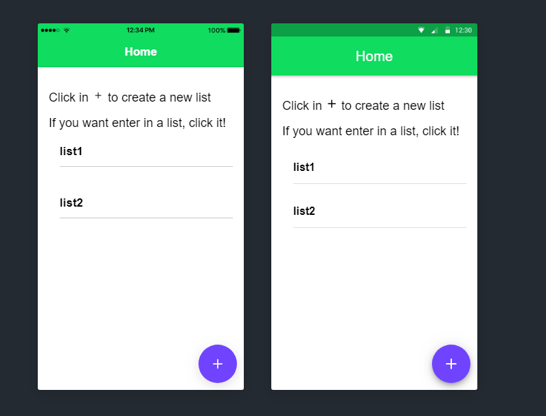
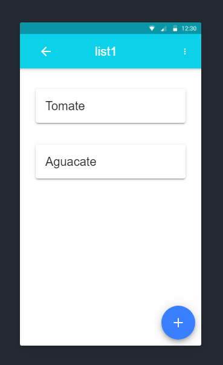

# Fullstack-ionic-spring

#### ApiList: This folder contain the back-end of the ListApp. It is made with Java with the framework Spring. 
#### ListApp: This folder contain the front-end.It is made with Ionic/Angular.

**ListApp** is a app that show shopping list, can search list in database and show all shopping lists. In this app, You can see your list
in the main page and you can modify name sliding it. If you want see the products in a list, click it and can enter. Also, this app contain 
two fab buttons to create list or products.

# Screenshot

# Acknowledgments
Spring:[Spring](https://spring.io/guides)
Ionic:[Ionic](https://ionicframework.com/docs)
Postman:[Postman](https://documenter.getpostman.com/view/8800418/SVtR2qZm?version=latest)
